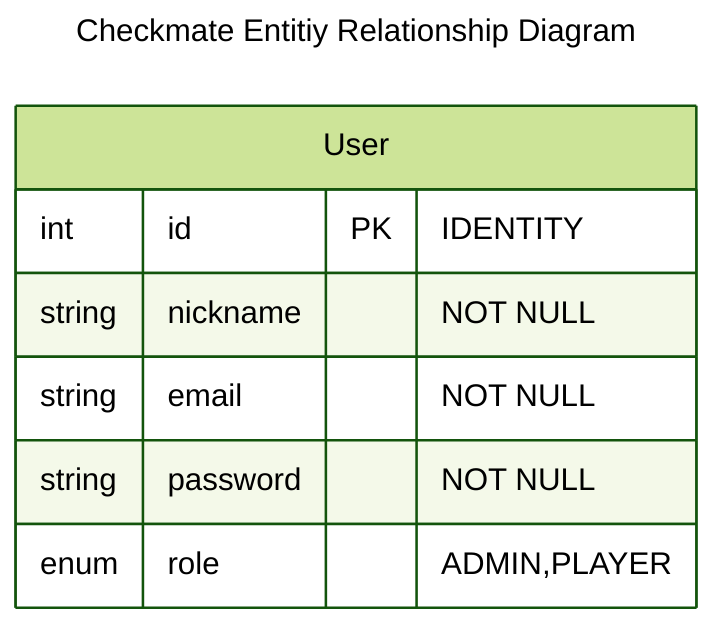

# Quizz

## Schéma

```mermaid
---
config:
  theme: 'forest'
title: Checkmate Entitiy Relationship Diagram
---

erDiagram
	User {
		int id PK "IDENTITY"
		string nickname "NOT NULL"
		string email "NOT NULL"
		string password "NOT NULL"
		enum role "ADMIN,PLAYER"
	}
	
```
