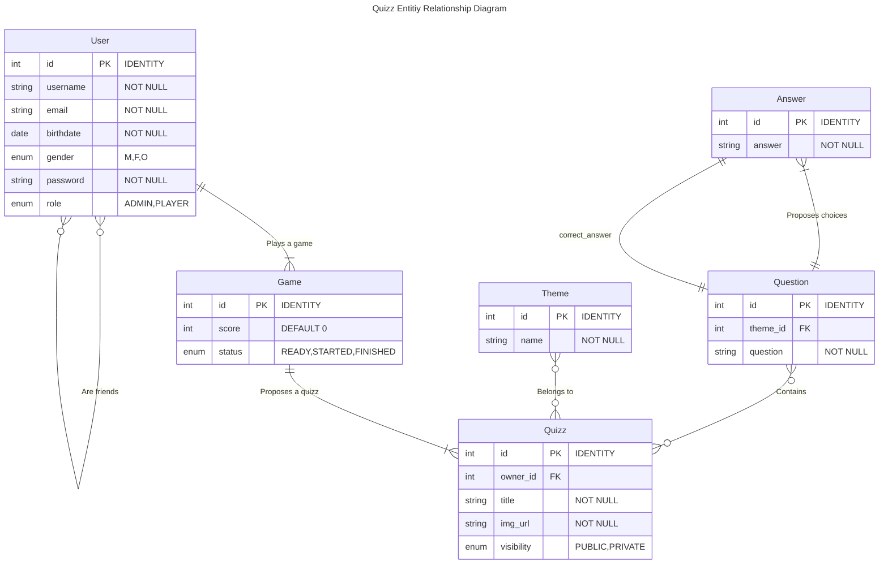

# Quizz

## Schéma

```mermaid
---
title: Quizz Entitiy Relationship Diagram
---

erDiagram
	User {
		int id PK "IDENTITY"
		string username "NOT NULL"
		string email "NOT NULL"
		date birthdate "NOT NULL"
		enum gender "M,F,O"
		string password "NOT NULL"
		enum role "ADMIN,PLAYER"
	}

    Quizz {
		int id PK "IDENTITY"
        int owner_id FK
        string title "NOT NULL"
        string img_url "NOT NULL"
        enum visibility "PUBLIC,PRIVATE"
    }


    Game {
		int id PK "IDENTITY"
        int score "DEFAULT 0"
        enum status "READY,STARTED,FINISHED"
        
    }

    Question {
		int id PK "IDENTITY"
        int theme_id FK
        string question "NOT NULL"
    }

    Answer {
		int id PK "IDENTITY"
        string answer "NOT NULL"
    }

    Theme {
		int id PK "IDENTITY"
        string name "NOT NULL"
    }

	User }o--o{ User : "Are friends"
	Question }o--o{ Quizz : "Contains"
	Theme }o--o{ Quizz : "Belongs to"
	Answer }|--|| Question : "Proposes choices"
	User ||--|{ Game : "Plays a game"
	Game ||--|{ Quizz : "Proposes a quizz"
	Answer ||--|| Question : "correct_answer"
```
